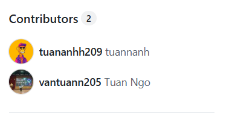

# STLRemit - Stellar Remittance MVP

A decentralized remittance platform built on Stellar blockchain enabling secure, fast, and low-cost cross-border money transfers through a trusted agent network.

---

## ✅ Submission Checklist

### 🔗 Live Demo
**[https://stlremitv2.up.railway.app/](https://stlremitv2.up.railway.app/)**

---

### 📱 Mobile Responsive View



---

### ⚙️ CI/CD Pipeline

[](https://github.com/tuananhh209/stlremitv2/actions/workflows/ci.yml)

Automated pipeline on every push to `main`:
- Node.js 20 setup
- `npm ci` dependency install
- TypeScript type check
- `npm run build` production build

---

### 📜 Contract Addresses & Transaction Hash

| Item | Address |
|------|---------|
| Escrow Contract | `CALP4YVV3YEYIISWQMZZX5JGTBIG6VMWMX5U7RHCWYONYEEITYEIXJZD` |
| USDC Token (Testnet) | `CDVSELRDNGPJNFGACTCH34TPIOBAQLGUKDALQE7P367AUCMYREBHJOA7` |

> Inter-contract calls are handled via the Soroban escrow contract: sender locks USDC → agent accepts → receiver confirms → contract releases funds automatically.

---

### 🪙 Token / Pool Address

- **USDC Token (Testnet):** `CDVSELRDNGPJNFGACTCH34TPIOBAQLGUKDALQE7P367AUCMYREBHJOA7`

---

## Architecture

```
Sender (VND) → STLRemit Frontend → Stellar Soroban Contract (Escrow)
                                           ↓
                              Agent locks USDC collateral
                                           ↓
                         Receiver confirms → Contract releases USDC
```

**Tech Stack:**
- Next.js 16 + TypeScript
- Stellar SDK + Soroban smart contracts
- Neon PostgreSQL + Drizzle ORM
- Railway deployment + GitHub Actions CI/CD

## Installation

```bash
git clone https://github.com/tuananhh209/stlremitv2.git
cd stlremitv2
npm install
cp .env.example .env.local
npm run dev
```

**Required env vars:**
```
DATABASE_URL=
ESCROW_CONTRACT_ID=
AGENT_SECRET_KEY=
AGENT_PUBLIC_KEY=
```

## License

MIT
